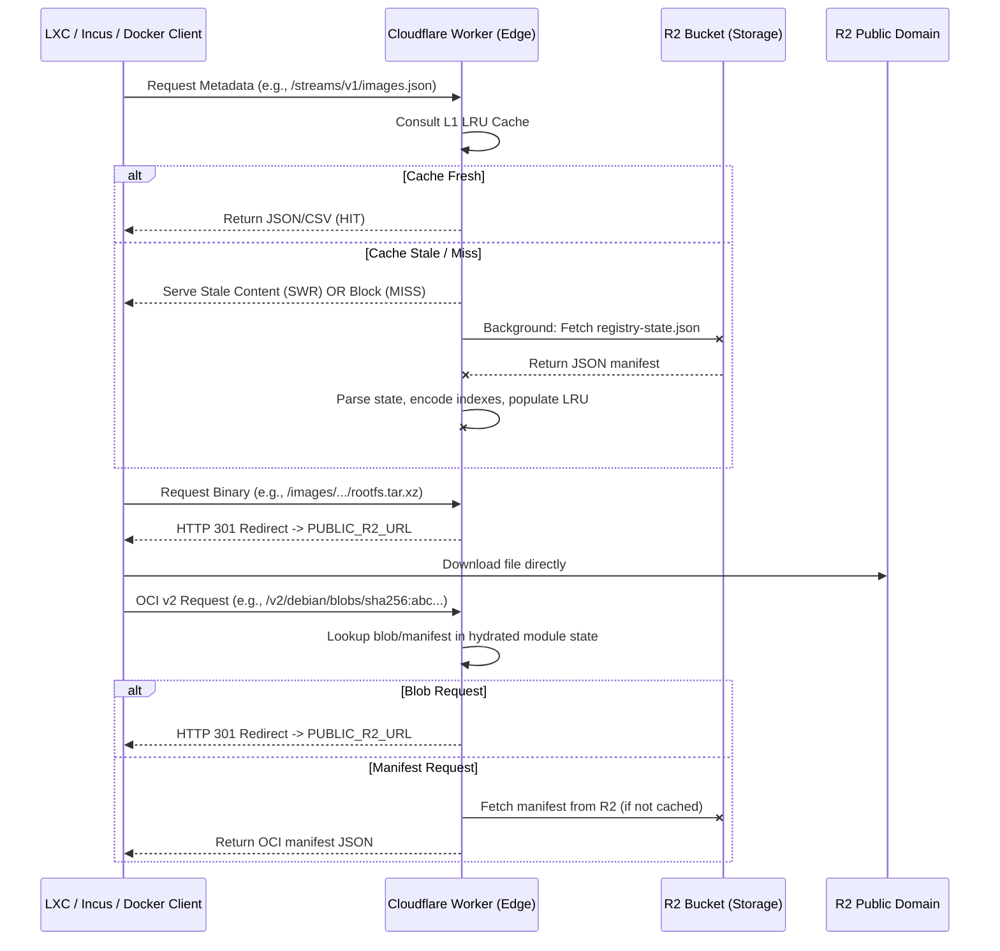

# Architecture: `debthin` Edge Image Server

## 1. System Overview

The `debthin` image distribution network uses a "Pre-compiled State / Smart Edge" architecture. A CI pipeline (`generate_image_manifest.py`) produces `registry-state.json` containing all index data (LXC CSV, Incus/LXD Simplestreams JSON, OCI blob/manifest dictionaries, and a file-size map) and uploads it to R2. A **Cloudflare Worker** at the edge fetches this state, hydrates it into RAM caches, and serves it to clients.

The Worker also implements an OCI Distribution API (`v2/`) for container registry operations and an Incus Simplestreams API (`streams/v1/`) for native `incus launch` support.

## 2. Request Flow Diagram



## 3. Module Structure

```
workers/images/
├── index.js          # Entry point: validation, routing, wrapHandler export
├── cache.js          # LRU cache instance + getCacheStats (wraps core/cache.js)
├── http.js           # Frozen header sets, static payloads, response builder
├── indexes.js        # registry-state.json lifecycle: fetch, parse, hydrate LRU
├── utils.js          # Shared utilities: SWR cache helpers, metadata classification
└── handlers/
    └── index.js      # Route handlers: LXC, Incus, OCI, image redirects/metadata
```

### Data Flow

1. **`index.js`** validates the request via `core/admin.js` and dispatches to a handler
2. **`indexes.js`** manages the `registry-state.json` lifecycle:
   - Fetches the manifest from R2
   - Parses the JSON and encodes LXC CSV + Incus JSON into ArrayBuffers for the LRU
   - Builds the dynamic Incus pointer (`streams/v1/index.json`) with product list
   - Stores OCI blob/manifest dictionaries and file-size map in module-level JS variables
3. **`handlers/index.js`** serves cached indexes, classifies image files by size,
   performs OCI lookups, and redirects large binaries
4. **`http.js`** builds conditional responses (304/200) with frozen header sets
5. **`cache.js`** provides the shared LRU cache instance

## 4. Core Responsibilities

### A. CI-Generated State (`registry-state.json`)

The CI pipeline (`generate_image_manifest.py`) pre-computes all index data:
- `lxc_csv`: Semicolon-separated CSV for classic LXC (`lxc-create -t download`)
- `incus_json`: Nested Simplestreams JSON tree for Incus/LXD (with `combined_squashfs_sha256` fingerprints and `release_title` fields)
- `oci_blobs`: Dictionary mapping `sha256:...` digests to R2 keys
- `oci_manifests`: Dictionary mapping `repo:tag` to R2 manifest keys
- `file_sizes`: Dictionary mapping R2 keys to byte sizes (used for metadata/redirect classification)

The Worker fetches this once per TTL cycle and hydrates the caches.

### B. State Hydration Strategy

During hydration (`hydrateRegistryState`):
- LXC CSV and Incus JSON are encoded to ArrayBuffers and stored in the LRU cache (they're served directly as HTTP response bodies)
- OCI blob/manifest maps and the file-size map are stored as plain JavaScript objects in module-level variables (no serialization needed, used for internal lookups only)
- The Incus pointer (`index.json`) is dynamically generated with the product key list and cached in the LRU

Concurrent hydration requests are coalesced via `indexCache.pending` to prevent thundering herd on cold starts.

### C. Stale-While-Revalidate (SWR)

On every inbound request, handlers check whether the cache entry has exceeded its TTL. If stale, a background refresh is triggered via `ctx.waitUntil()` while the existing cached data is served immediately. This keeps response times low during revalidation.

### D. OCI Distribution API

The `/v2/` route implements a subset of the OCI Distribution Spec:
- `GET /v2/` — Version check (returns `{}` with `Docker-Distribution-Api-Version` header)
- `GET /v2/<repo>/blobs/<digest>` — 301 redirect to R2 public domain
- `GET /v2/<repo>/manifests/<ref>` — Serves OCI manifest JSON from R2 (cached in LRU)
  - For inner manifests (`sha256:` refs): single-arch `image.manifest.v1+json`
  - For tag refs: multi-arch `image.index.v1+json`

### E. Metadata vs. Binary Classification

Files under `/images/` are classified by size using the `file_sizes` map:
- **≤100KB** → served from the LRU cache (fetched from R2 on miss)
- **>100KB** → 301 redirect to the unmetered R2 public domain

The `oci-layout` file is hardwired as a static 30-byte immutable response.

### F. Bandwidth Optimization (301 Pattern)

Large binary downloads (`rootfs.*`, `incus.tar.xz`, OCI blobs) are never proxied. The Worker returns a `301 Moved Permanently` redirect to the R2 public domain (`env.PUBLIC_R2_URL`), keeping Worker CPU and bandwidth costs minimal.

## 5. Routing Table

| Route | Client | Action | Cache Strategy |
|:---|:---|:---|:---|
| `robots.txt` | Crawlers | Synthetic disallow-all | No-store |
| `health` | Monitoring | R2 probe + cache stats JSON | No-store |
| `_cache_status.{secret}` | Admin | L1 cache stats | No-store |
| `_cache_flush.{secret}` | Admin | Flush all L1 caches | No-store |
| `/meta/1.0/index-system` | Classic LXC (`lxc-create`) | Serve pre-compiled CSV index | L1 LRU + SWR |
| `/streams/v1/index.json` | Incus (`incus remote add`) | Serve dynamic JSON pointer | L1 LRU + SWR |
| `/streams/v1/images.json` | Incus (`incus launch`) | Serve pre-compiled Simplestreams JSON | L1 LRU + SWR |
| `/v2/` | Docker / OCI clients | Return version handshake | Static |
| `/v2/<repo>/blobs/<digest>` | Docker / OCI clients | 301 redirect to R2 public | Immutable (1 year) |
| `/v2/<repo>/manifests/<ref>` | Docker / OCI clients | Serve OCI manifest from R2 | L1 LRU |
| `/images/*/oci/oci-layout` | OCI clients | Hardwired static response | Immutable (1 year) |
| `/images/*` (≤100KB) | All clients | Serve from R2 via LRU cache | L1 LRU (1 hour) |
| `/images/*` (>100KB) | All clients | 301 redirect to R2 public | Immutable (1 year) |

## 6. Safety and Fault Tolerance

* **Request Validation:** `core/admin.js` rejects bad methods, query strings, traversal (`..`), and scanner probes (`.git`, `.env`, `xmlrpc`, `ecp/`, `wp-includes`).
* **Deduplication:** Concurrent hydration requests are coalesced via `indexCache.pending`, preventing thundering herd on cold starts.
* **Missing State:** If `registry-state.json` is absent from R2, hydration throws and individual handlers return 404.
* **Missing OCI Keys:** Unknown blob digests return `BLOB_UNKNOWN`; unknown manifest refs return `MANIFEST_UNKNOWN` (both with structured JSON error bodies).
* **HEAD Optimization:** HEAD requests skip body generation (pass `null` buffer) while exercising the full cache/conditional path.

## 7. Performance

* **Cost:** R2 public domain handles binary egress for free. The Worker only serves small JSON/CSV metadata and redirect responses.
* **Memory:** The LRU cache is bounded to 20MB / 256 slots with automatic eviction.
* **Cold Start:** `ctx.waitUntil()` background hydration pre-warms the cache on every request, minimising the impact of isolate restarts.
* **Manifest Parsing:** `registry-state.json` is parsed once per hydration cycle. OCI and file-size maps are stored as plain JS objects; only the served indexes (LXC CSV, Incus JSON, Incus pointer) are encoded to ArrayBuffers in the LRU.