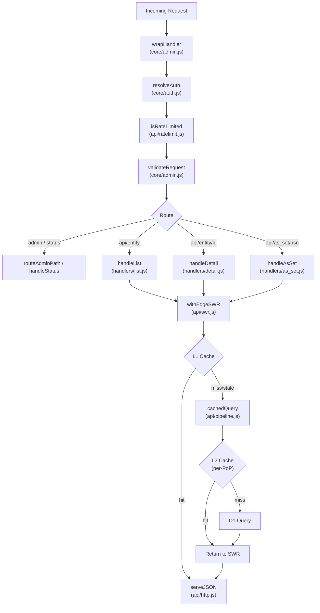
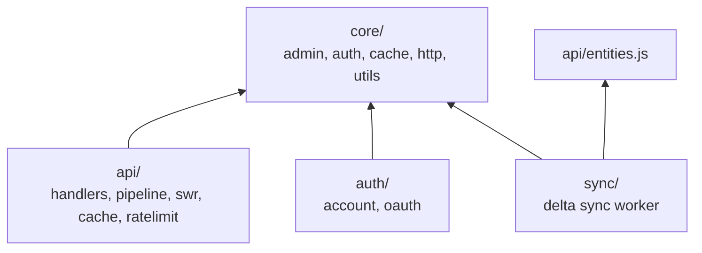

# pdbfe Worker Architecture

The Cloudflare Worker codebase is structured to enforce strict boundaries between core network primitives and the PeeringDB application domain.

## Request Flow

## Layer Dependencies

`core/` has zero imports from `api/`, `auth/`, or `sync/`.

## 1. Core Primitives (`workers/core/`)
The foundation layer. Contains generic, reusable components that have zero knowledge of PeeringDB entities or the API domain. Shared by both the API and sync workers.

- **`admin.js`**: Shared request validation and administrative endpoints. Exports:
  - `validateRequest(request, rawPath, methods)` — method, traversal, and scanner probe checks. Query strings are allowed (required for PeeringDB filters).
  - `routeAdminPath(rawPath, env, opts)` — robots.txt, health (with D1 probe), secret-gated `_cache_status`/`_cache_flush`
  - `wrapHandler(handler, serviceName)` — error trapping, X-Timer, X-Served-By, X-Isolate-ID, and default X-Auth-Status headers
- **`cache.js`**: TypedArray LRU cache. Uses contiguous `Uint32Array`, `Float64Array`, and `Int32Array` blocks for zero-GC eviction. Instantiated 14 times by `api/cache.js` (one per entity) and once by `api/ratelimit.js`.
- **`http.js`**: JSON response serving, ETag generation (DJB2 hash), 304 Not Modified handling, precompiled frozen CORS headers, Last-Modified / If-Modified-Since helpers, and `encodeJSON()` for single-serialisation-point caching. Pre-cooked header sets (`H_API_AUTH`, `H_API_ANON`, `H_NOCACHE_AUTH`, `H_NOCACHE_ANON`) bake in `X-Auth-Status`, `Allow`, and `X-App-Version` to avoid per-request Response cloning. `serveJSON()` and `jsonError()` accept an optional base headers parameter to select the right set.
- **`utils.js`**: Zero-allocation URL parsing (`parseURL`) and generic string tokenization (`tokenizeString`). Domain-specific utilities (query filter parsing, cache-key normalisation) live in their respective api/ modules.
- **`auth.js`**: API key extraction from `Authorization: Api-Key` headers, SHA-256 key verification against USERDB D1 with per-isolate 5-minute cache, session ID extraction from Bearer tokens and cookies, session resolution against SESSIONS KV, and `resolveAuth()` — top-level auth pipeline returning `{authenticated, identity, rejection}`.

## 2. API Domain (`workers/api/`)
The primary traffic handler serving read-only PeeringDB API responses.

- **`index.js`**: Top-level router. Resolves authentication (API key or session), selects pre-cooked header sets (`H_API_AUTH`/`H_API_ANON`) once per request, applies per-isolate rate limiting, validates requests, dispatches to admin endpoints, CORS preflight, entity handlers, or returns 501 for write methods. Entity routes check `If-Modified-Since` against `getEntityVersion()` for zero-cost 304 shortcuts before any cache or D1 work, and inject `Last-Modified` on responses.
- **`pipeline.js`**: Shared D1 query pipeline used by all handlers. The `cachedQuery()` function encapsulates promise coalescing (stampede prevention), L2 cache lookups, D1 query execution, and L1+L2 cache write-back. Handlers pass a `queryFn` closure containing D1-specific logic. Also exports `EMPTY_ENVELOPE` (negative cache sentinel) and `isNegative()` (byte-level sentinel detection for L2 cache entries).
- **`handlers/index.js`**: Route handlers for list, detail, AS set, count, and 501 Not Implemented. Two code paths based on depth:
  - **depth=0 (hot)**: `buildJsonQuery` → D1 returns pre-formatted JSON envelope string → `TextEncoder.encode()` → cache → serve. Zero V8 object allocations per row.
  - **depth>0 (cold)**: `buildRowQuery` → V8 row expansion → `JSON.stringify` → cache → serve.
  - **D1 query pipeline**: All D1 queries delegate to `cachedQuery()` (pipeline.js) which owns promise coalescing, L2 cache reads/writes, and negative caching.
  - **SWR pre-fetch**: Paginated next pages fetched in background via `ctx.waitUntil()`.
- **`entities.js`**: Re-exports precompiled entity definitions from `extracted/entities-worker.js` and provides field accessor helpers (`getFilterType`, `getColumns`, `getJsonColumns`, `getBoolColumns`, `getNullableColumns`, `validateQuery`, `validateFields`, `resolveImplicitFilters`, `resolveCrossEntityFilter`). Entity metadata — fields, relationships, join columns, and cached lookup sets — is computed at generation time by `parse_django_models.py`. Also re-exports `VERSIONS` (upstream `django_peeringdb` and `api_schema` versions) used by `http.js` for the `X-App-Version` header.
- **`query.js`**: Dual query builder:
  - `buildJsonQuery()` — wraps SELECT in `json_group_array(json_object(...))` returning the full JSON envelope as a single D1 string. JSON-stored columns (`social_media`, `info_types`, `available_voltage_services`) are unwrapped with SQLite `json()` to prevent double-escaping.
  - `buildRowQuery()` — traditional SELECT returning individual rows (for depth>0 expansion).
  - Both share `buildWherePagination()` for filter/pagination SQL construction.
- **`depth.js`**: Depth expansion for `_set` fields. depth=0 is a no-op; depth=1 returns child IDs via batched IN queries.
- **`cache.js`**: Creates and configures 14 per-entity LRU cache instances across three tiers (1024/256/128 slots). Exposes `getCacheStats()`, `purgeAllCaches()`, `purgeEntityCache()`, `normaliseCacheKey()`. Defines TTL constants: `LIST_TTL` (60 min), `DETAIL_TTL` (60 min), `COUNT_TTL` (60 min), `NEGATIVE_TTL` (5 min). TTLs are upper bounds — data freshness is handled by the 15s invalidation poll in `sync_state.js`.
- **`ratelimit.js`**: Isolate-level rate limiter using a dedicated LRU cache (4000 slots, 60s window). IPv6 addresses normalised to /64 prefixes. Anonymous callers keyed by IP (60/min), authenticated by API key or session ID (600/min). Exports `isRateLimited()`, `normaliseIP()`, `getRateLimitStats()`, `purgeRateLimit()`.
- **`l2cache.js`**: Per-PoP L2 cache using Cloudflare's Cache API (`caches.default`). Functions `getL2(cacheKey)` and `putL2(cacheKey, buf, ttlSeconds)` store/retrieve `Uint8Array` payloads keyed by synthetic URLs under `https://pdbfe-l2.internal/`. L2 keys are version-tagged via `getEntityVersion()` from `sync_state.js` — when entity data changes, old L2 entries are orphaned without enumeration. Errors silently degrade to D1 fallback.
- **`http.js`**: API-specific HTTP response helpers. Inherits from `core/http.js` and layers API-specific frozen header sets (`H_API`, `H_API_AUTH`/`ANON`, `H_NOCACHE_AUTH`/`ANON`) with `X-Auth-Status`, `Allow`, and `X-App-Version`. Exports `serveJSON()` (ETag + 304 handling) and `withLastModified()`. Re-exports core symbols for single-import convenience.
- **`utils.js`**: PeeringDB Django-style query filter parser (`parseQueryFilters`). Handles `__lt`, `__gt`, `__contains`, `__startswith`, `__in` suffixes, reserved parameters (depth, limit, skip, since, sort, fields), and cross-entity filters.
- **`swr.js`**: `withEdgeSWR()` — stale-while-revalidate wrapper that encapsulates L1 cache reads, synchronous field extraction (shared `_ret` contract), SWR background refresh via `ctx.waitUntil()`, and `cachedQuery()` fallback for misses. Used by all API handlers instead of raw cache + pipeline calls.
- **`sync_state.js`**: Background D1 polling for granular cache invalidation and zero-allocation `/status` serving. Polls `_sync_meta` every 15s via `ctx.waitUntil()`. Compares `last_modified_at` per entity — if changed, purges only that entity's L1 cache. Exports `ensureSyncFreshness(db, ctx, now)` (O(1) hot-path hook), `handleStatus()` (pre-encoded `/status` response), and `getEntityVersion(tag)` (L2 version tagging).

## 3. Sync Domain (`workers/sync/`)
Scheduled worker running delta sync from upstream PeeringDB via Cron Trigger (every 15 min).

- **`index.js`**: Exports `{ scheduled, fetch }` handlers. Cron reads last sync timestamp from `_sync_meta`, fetches `?since=<epoch>&depth=0` per entity, UPSERTs active rows via `INSERT OR REPLACE`, deletes rows with `status='deleted'`. Batches in groups of 50 to stay within D1 limits. HTTP endpoints for manual control (`GET /sync/status`, `POST /sync/trigger`).
- **`entities.js`**: Re-exports entity definitions from `api/entities.js` (no duplication).

## 4. Tests (`workers/tests/`)

Unit tests are organised into subdirectories mirroring the source layout:

- **`tests/unit/core/`**: `auth.test.js` (API key, session, resolveAuth), `cache.test.js` (LRU), `utils.test.js` (tokenizeString, parseURL)
- **`tests/unit/api/`**: `query.test.js`, `depth.test.js`, `pipeline.test.js`, `swr.test.js`, `ratelimit.test.js`, `headers.test.js`, `status.test.js`, `sync_state.test.js`, `sync.test.js`, `visibility.test.js`
- **`tests/unit/auth/`**: `account.test.js` (API key CRUD)
- **`tests/unit/antipatterns.test.js`**: Cross-cutting check for banned patterns in source files
- **`tests/test_api.js`**: Integration — full router with mock D1, admin endpoints, CORS, 501s, scanner blocking
- **`tests/test_conformance.js`**: Envelope, schema, query parameter, data type, cross-endpoint, and error handling conformance against live upstream PeeringDB
- **`tests/test_conformance_extended.js`**: Substring/prefix filters, carrier/campus entities, timestamp ranges, sorting, concurrency, field selection, numeric filters
- **`tests/test_equivalence.js`**: Compares responses against the live PeeringDB API for a set of reference queries
- **`tests/loadtest.js`**: Production load test covering sequential cold/warm scenarios, parallel bursts, sustained throughput, and negative cache (404) validation across entity types
